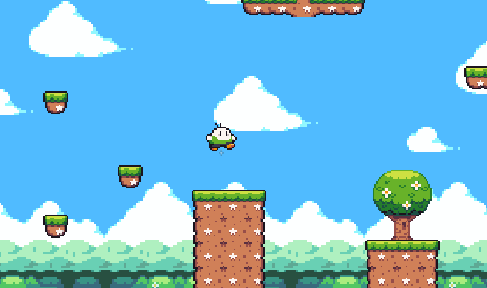

# 🎮 Projeto Plataforma 2D — Godot Engine

## 📝 Descrição do Projeto

Este é um projeto experimental de jogo de plataforma 2D desenvolvido com a **Godot Engine**. O objetivo principal é **testar mecânicas**, **explorar funcionalidades da engine** e **aprender novas linguagens de programação disponíveis na Godot**, como GDScript, C#, entre outras.
O jogo é inspirado em títulos clássicos como **Super Mario**, mas não tem a intenção de ser um jogo completo — ele serve como base para estudos, prototipagem e testes.

---

## 🕹️ Objetivos

- Explorar os recursos da Godot Engine.
- Praticar criação de jogos com foco em plataformas 2D.
- Aprender e testar linguagens como GDScript e C# na Godot.
- Estudar física, colisões, animações, som e interface dentro do ambiente Godot.

---

## 📸 Imagens do Jogo

> *Adicione abaixo capturas de tela ou GIFs do jogo em execução.*

| Cena do Jogo | Animações |
|--------------|-----------|
|  |  |

---

## 🚧 Status do Projeto

🔧 Em desenvolvimento — funcionalidades e mecânicas sendo testadas continuamente.

---

